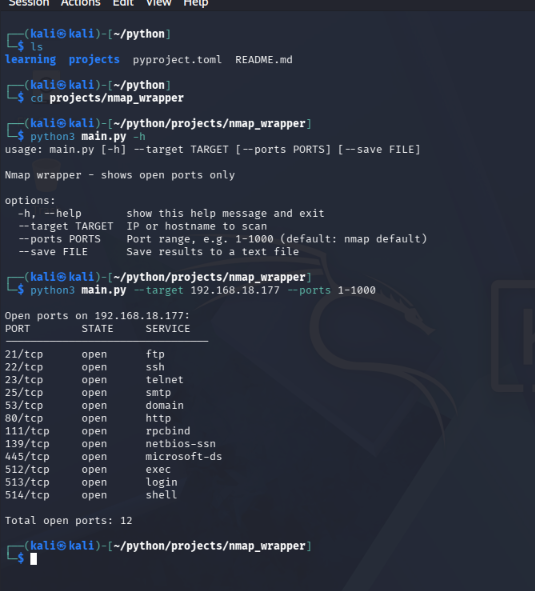

# nmap_wrapper

> A simple Python CLI that runs Nmap for you and shows only the open ports.

Status: 🚧 Learning project (in progress)

<p align="center">
  
  
  
  
</p>

<p align="center">
  <a href="#-features">Features</a> •
  <a href="#-demo">Demo</a> •
  <a href="#-quick-start">Quick Start</a> •
  <a href="#-usage">Usage</a> •
  <a href="#%EF%B8%8F-how-it-works">How It Works</a> •
  <a href="#%EF%B8%8F-roadmap">Roadmap</a>
</p>

> [!WARNING]
> **Only scan machines you own or have permission to test.**
> `scanme.nmap.org` is provided by the Nmap project for safe practice.

---

## ✨ Features

| | Feature |
|---|---|
| 🖥️ | Simple command-line interface (`--target`, `--ports`, `--save`) |
| 🎯 | Shows **open ports only**, with state and service name |
| 💾 | Save results to a text file |
| 🛡️ | Clear error messages (Nmap missing, timeout, bad target) |
| 🐍 | Pure Python standard library, no `pip install` needed |

---

## 📸 Demo

<p align="center">
  
</p>

Example output:

```
Open ports on scanme.nmap.org:
PORT        STATE     SERVICE
--------------------------------
22/tcp      open      ssh
80/tcp      open      http

Total open ports: 2
```

---

## ⚡ Quick Start

```bash
git clone https://github.com/bibashthapa143/python.git
cd python/projects/nmap_wrapper
python3 nmap_wrapper.py --target scanme.nmap.org
```

That's it. Make sure Nmap is installed first (see below).

<details>
<summary><b>📦 Requirements and Nmap installation</b></summary>

<br>

- Python 3
- Nmap installed and available in your PATH

```bash
# Kali / Ubuntu / Debian
sudo apt install nmap

# macOS
brew install nmap
```

On Windows, download it from https://nmap.org/download.html (keep "add to PATH" ticked).

Check it works:

```bash
nmap --version
```

</details>

---

## 🚀 Usage

```bash
python3 nmap_wrapper.py --target <ip-or-hostname> [--ports <range>] [--save <file>]
```

> 💡 On Windows, use `python` or `py` instead of `python3`.

| Argument | Required | Description |
|----------|:--------:|-------------|
| `--target` | ✅ | IP address or hostname to scan |
| `--ports` | ❌ | Ports to scan, e.g. `1-1000` or `22,80,443` (default: Nmap's top 1000 TCP ports) |
| `--save` | ❌ | Save results to a text file, e.g. `results.txt` |

> [!NOTE]
> Scans time out after 60 seconds, so very wide ranges such as `1-65535` may not finish.

**Examples**

```bash
# Default scan
python3 nmap_wrapper.py --target scanme.nmap.org

# Scan the first 1000 ports
python3 nmap_wrapper.py --target scanme.nmap.org --ports 1-1000

# Scan specific ports on a local lab machine
python3 nmap_wrapper.py --target 192.168.56.101 --ports 22,80,443

# Scan and save the results
python3 nmap_wrapper.py --target scanme.nmap.org --ports 1-1000 --save results.txt

# Show help
python3 nmap_wrapper.py --help
```

---

## ⚙️ How It Works

```
 --target / --ports      nmap          parse XML        open ports        (save)
 ───────────────────▶  (subprocess) ──────────────▶  ──────────────▶  ────────────▶  file
```

1. Reads `--target`, `--ports` and `--save` using `argparse`.
2. Runs `nmap` with `subprocess.run()` and XML output (`-oX -`), with a 60 second timeout.
3. Stops with a clear message if Nmap is missing, times out, fails, or the target can't be resolved.
4. Parses the XML with `xml.etree.ElementTree` and keeps only open TCP ports.
5. Prints each port with its state and service as a table.
6. If `--save` is given, writes the same table to a file.

> [!TIP]
> **Security note:** Nmap is called with an argument list (no `shell=True`), so the value of `--target` is never interpreted by a shell.

---

## 📁 Project Structure

```
nmap_wrapper/
├── images/
│   └── demo.png
├── nmap_wrapper.py
└── README.md
```

---

## 🗺️ Roadmap

- [x] Let the user choose the port range
- [x] Split each line into port, state, and service
- [x] Add an `argparse` command-line interface
- [x] Parse Nmap XML output
- [x] Save results to a file
- [ ] Add UDP port support (slower, and usually needs root/administrator privileges)
- [ ] Add a `--timeout` option

---

## 📄 License

Released under the MIT License. Add a `LICENSE` file to the repo to match.

<p align="center">
  Made with 🐍 while learning network security<br>
  ⭐ Star the repo if you found it useful!
</p>
